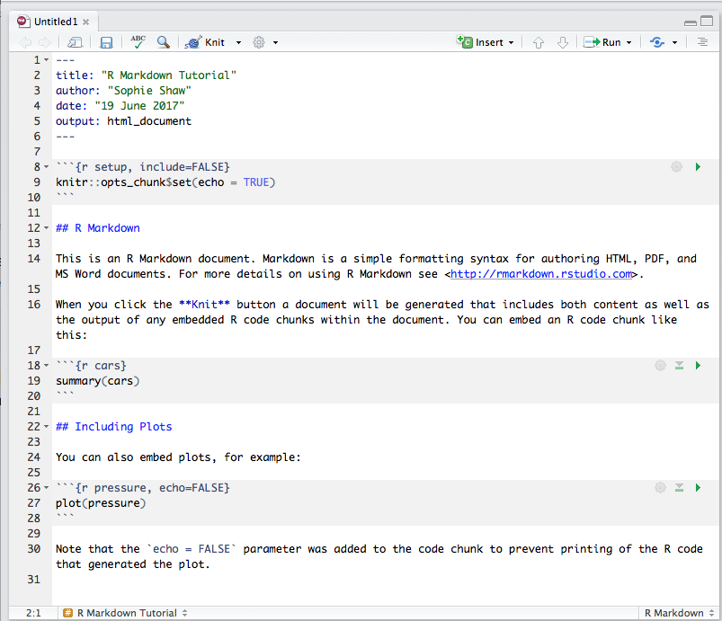

<!-- change visible to true if you want it on the site -->

 - **Author**: [Dr. Sophie Shaw](https://github.com/SophieS9) 
 - **Research field**: Bioinformatician working on analysis of Next Generation Sequencing Data

# Introduction to R Markdown
It's important during research to keep a thorough record of your analysis. This is a common practice within the wet lab with all researchers keeping a lab book. However when it comes statistics and plots, people are less cautious about recording what they have done. R has several nice ways to record your activites, and to make these as reproducible as possible including R Scripts and R Markdown. As a researcher who uses R on a daily basis, I started out using R Scripts to record my research. However, I've often found myself lost in a 1000 line script, trying to work out what each line of script is doing and what plots are produced. Even with thorough notation of the script, this can often still be confusing. R Markdown is a nice solution to this situation, allowing you to group your code into "chunks" as well as acting like a notebook, with plots pictured directly below the code. It also has the ability to the render the R Markdown into easy-to-read documents including PDF, html or word document formats, allowing for easy production of reports.

This workshop has been largely inspired by the fantastic resources available at the [R Markdown Website](http://rmarkdown.rstudio.com/index.html).

## What is Markdown and R Markdown?
Markdown is a coding language that allows for text-to-HTML conversion. It was originally designed for web developers to allow for editing of web pages with an easy-to-read and easy-to-write plain text format. This webpage has been written in Markdown and then github has rendered this to allow you to view it as a webpage. You can see the original Markdown code [here](https://raw.githubusercontent.com/SophieS9/SG-RMarkdown-Intro/master/Intro_RMarkdown.md). Due to it's basic nature, you need none to very little programming knowledge in order to write in Markdown! 

R Markdown is a variation on Markdown allowing it to be implemented in R. This [video](https://vimeo.com/177254549) gives a great, short explanation of R Markdown.

## Using R Markdown in RStudio
The benefits of R Markdown are best appreciated when using it within RStudio. If you don't already have RStudio, you can download it from the following [link](https://www.rstudio.com/products/rstudio/download/). 

RStudio is an easy to use graphical user interface for running R. It allows you to view scripts, the console, your environment and plots all within one window. For more details on this, see our workshop on [Version Control with RStudio and Github](https://aberdeenstudygroup.github.io/studyGroup/lessons/SG-T1-GitHubVersionControl/VersionControl/).

Once RStudio is installed and running, your window should look something like this:

<p align=center>

</p>

As well as installing RStudio, you'll need to have the package for rmarkdown installed. To do this, in the console panel (on the left), run:
```
install.packages("rmarkdown")
```

You should now be able to open a new R Markdown file. To do this go to the "Open" symbol in the top left hand corner and select "R Markdown"

<p align=center>

</p>

The following window then asks you for a title, the author and what format you'd like the final rendered file to be. All of these elements can be changed later if you change your mind. You can also see from the left hand tab that R Markdown can be used to make other things besides documents, including presentations and shiny apps.

Give the document an appropriate name and choose "HTML" as the output format:

<p align=center>

</p>

The new R Markdown file should now have opened on the left hand side, above the console window. A template R Markdown script is provided. This includes the set up information at the top of the page. This is used by knitr during rendering to produce the correct file format. Text and code blocks are also included, and these will be explained in more detail below. 

<p align=center>

</p>


## Code Chunks and Plots

The template R Markdown script includes three code chunks. You can specify a code chunk by starting it \```{r} and ending it with \```. Code within these blocks can be run within the console by either selecting the "Run" option at the top of the window or by clicking on the green arrow within the code chunk:

<p align=center>

</p>

This runs the code within the console, just like a normal script, and output that would have been printed in the console is embedded within the R markdown file beneath the code chunk. This includes text, tables, plots and any error messages. Code chunks can contain anything that would run in the console, as well as comments lines that start with a hash. The can have as many lines of code as you like. Have a go at running the code chunks which have been provided by the default template.
 
The first code chunk:
```` 
```{r setup, include=FALSE}
knitr::opts_chunk$set(echo = TRUE)
``` 
````
is used to specify any global settings to be applied to the markdown. The example sets all code chunks as "echo=TRUE", meaning they will be included in the final rendered version. You can specify other settings in this code chunk, such as the working directory. 

The {r} part of the code chunk can be used to specify elements for when the R markdown file is rendered into a different format. You can see the third code chuck is as follows:
```` 
```{r pressure, echo=FALSE}
plot(pressure)
``` 
````
The code chunk has been given the name "pressure" as well as having the parameter "echo=FALSE". This will prevent the code chunk from being printed when the markdown script is rendered to a different file format. Additional parameters can include "fig.height=" and "fig.width=" which specify how big a plot should be. 

Have a go at making some code chunks of your own. Here are some ideas if you're stuck, otherwise create chunks containing your own code:
* Plotting the cars data, with the figure size set:
````
```{r plot_cars, fig.height=3, fig.width=3}
plot(cars)
```
````
* Summarising the built-in PlantGrowth data set:
````
```{r plantsummary}
summary(PlantGrowth)
```
````
* Box plot of PlantGrowth data:
````
```{r plant_box, fig.height=6, fig.width=6}
boxplot(weight ~ group, PlantGrowth, col=c("pink","lightgreen","purple"))
legend("topleft", legend=c("Group","Control","Treatment1","Treatment2"), pch=c(NA,19,19,19), col=c(NA,"pink","lightgreen","purple"))
```
````
## Adding and Formatting Text
In between your code chunks you can put any text you like. This can be explanatory text, figure legends, anything you want! Although having code chunks and outputs together in one document is a great aspect of R markdown, the best part is actually the ability to turn your R markdown document into another format, such as HTML, PDF or word. In this final document you're going to want to have your text elements formatted. You might want headers, bold text, italics, bullet point lists etc... R markdown allows for this, you just have to add markdown syntax to specify how you want the document. 

Here are some examples. Add these to your R markdown document. In each case I've written what you should be adding to your R markdown script on the first line, and then how this is rendered on the line below. 

\# Header One 
# Header One
\## Header Two
## Header Two
\### Header Three
### Header Three

\**Bold text**  
**Bold text**

\*italic text*  
*italic text*

\--strikethrough--  
~~strikethrough~~

superscript^2^  
superscript<sup>2</sup>  

\* Bullet points
* Bullet points

\[Hyperlink](www.google.com)  
[Hyperlink](www.google.com)  

## Inserting Images

## Inserting Tables
 
## Inserting Citations

## Rendering R Markdown into Documents
